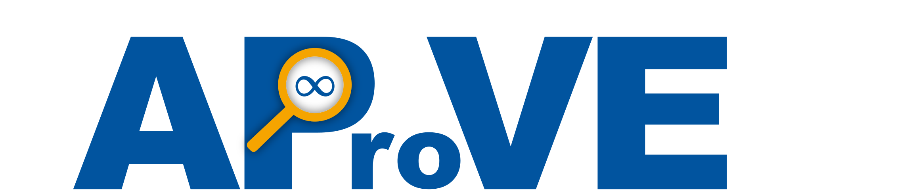
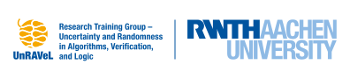

I have been a research assistant and PhD student in the [Research Group “Pro­gram­ming Languages and Verification”](https://verify.rwth-aachen.de/index_e.html) headed by Professor Jürgen Giesl since October 2022 and I am one of the main developers of the [Automated Program Verification Environment (AProVE)](https://aprove.informatik.rwth-aachen.de/) tool. Moreover, I am part of the interdisciplinary Research Training Group [UnRAVeL](https://www.unravel.rwth-aachen.de/cms/~ofgh/unravel/lidx/1/).

**Personal Research**:
My research focuses on theoretical computer science and I’m interested in all aspects of automated reasoning and verification of (probabilistic) programs.
Due to the massive increase in automatically generated code, I am strongly convinced that formal verification will become indispensable in the future.
In particular, my PhD-topic is on fully automated termination and complexity analysis of functional programs dealing with data structures. For this, I focus on analyzing termination and (expected) complexity of (probabilistic) term rewriting, which is a very basic functional programming language.
The following is an example of a term rewriting system (TRS), which computes the addition of two natural numbers represented by the zero function 0 and the successor function s(...).

The nice part of TRSs is that there exists automatized translations, e.g., from Java programs to TRSs, so that analyzing termination and complexity of TRSs directly leads to techniques for analyzing other programming languages like Java.
All my contributions on (probabilistic) term rewriting and the previously mentioned translations are implemented in the [Automated Program Verification Environment (AProVE)](https://aprove.informatik.rwth-aachen.de/) Tool.

In probabilistic programs, in addition to standard control structures like if-statements and recursion, there is the possibility to flip a coin. Depending on the result of the coin flip, the program can then proceed in different ways.
Probabilistic programs are used to describe randomized algorithms and probability distributions, with applications in many areas, e.g., machine learning, to handle uncertainty in data or to create robust algorithms.

Apart from probabilistic term rewriting, I am generally interested in:
<ul style="margin-top: 0; margin-bottom: 0; padding-left: 20px; line-height: 1.2;">
  <li>Program Analysis, Probabilistic Programs, Verification (of Probabilistic Systems), Rewriting, Automated Deduction, ... </li>
  <li>Foundations of Mathematics and Computer Science: Logic, Set Theory, Proof Theory, ...</li>
  <li>SAT and SMT-Solving w.r.t. different theories</li>
</ul>

 

**AProVE**:
[AProVE](https://aprove.informatik.rwth-aachen.de/) is a system for automated termination and complexity proofs of term rewrite systems (TRSs) and several variations of TRSs. 
Moreover, AProVE also handles several other formalisms, e.g., imperative programs (Java Bytecode and C / LLVM), functional programs (Haskell 98), and logic programs (Prolog). 
The power of AProVE is demonstrated in the [annual International Competition of Termination Tools](https://termination-portal.org/wiki/Termination_Competition) and the [International Competition](https://sv-comp.sosy-lab.org/) on Software Verification. 
AProVE also won two Kurt Gödel medals at VSL 2014. 

  

 

**UnRAVeL**:
[UnRAVeL](https://www.unravel.rwth-aachen.de) (**UN**certainty and **R**andomness in **A**lgorithms, **VE**rification and **L**ogic) is an interdisciplinary Research Training Group funded by the German Research Foundation (DFG). 
The goal is to significantly advance probabilistic modelling and analysis for uncertainty by developing new theories, algorithms, and tool-supported verification techniques, and to apply them to core problems of security, planning, and safety and performance analysis.
To tackle these research challenges, theoretical computer scientists from computer-aided verification, logic and games, algorithms and complexity, together with experts from management science, and railway engineering form the core of this Research Training Group. 

  

