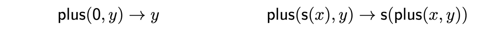
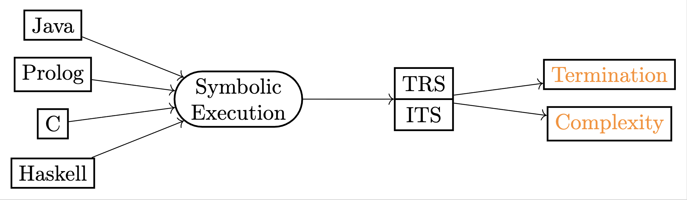
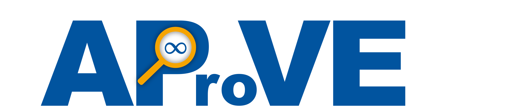
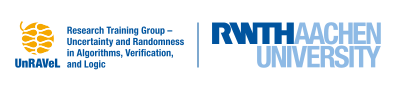

I have been a research assistant and PhD student in the [Research Group “Pro­gram­ming Languages and Verification”](https://verify.rwth-aachen.de/index_e.html) headed by Professor Jürgen Giesl since October 2022 and I am one of the main developers of the [Automated Program Verification Environment (AProVE)](https://aprove.informatik.rwth-aachen.de/) tool. Moreover, I am part of the interdisciplinary Research Training Group [UnRAVeL](https://www.unravel.rwth-aachen.de/cms/~ofgh/unravel/lidx/1/).

**Personal Research**:
My research is on theoretical computer science, with a particular focus on automated reasoning and the verification of probabilistic programs. In a world where code is increasingly generated automatically,
e.g., through program synthesis, AI-assisted development, or template-based code generators,
automatic formal verification is more pressing than ever. 
I strongly believe that formal verification will remain an essential role in building reliable software systems in the future.

In my PhD, I study fully automated termination and complexity analysis for functional programs that manipulate data structures. More specifically, I investigate the termination and expected complexity of probabilistic term rewriting systems, a simple yet Turing complete foundational model of computation.

An example of a term rewriting system for addition on natural numbers is shown below.
Here, natural numbers are represented by the successor function s(...) and the zero function 0.

One particularly attractive aspect of term rewriting is that there are automated translations from practically relevant programming languages, such as Java, into rewriting formalisms. 

This makes it possible to transfer powerful termination and complexity techniques from rewriting theory to the analysis of real-world programs.

All my contributions on the analysis of probabilistic term rewriting are implemented in the [Automated Program Verification Environment (AProVE)](https://aprove.informatik.rwth-aachen.de/) tool.

In probabilistic programs, standard control structures such as conditionals and recursion are enriched by random choices, for example by flipping a coin. These programs are a natural way to model randomized algorithms and probability distributions, with applications ranging from machine learning to robust decision-making under uncertainty.
Incorporating probabilities into algorithms has several advantages in practice, 
e.g., to decrease the expected runtime of an algorithm.
For example, randomized quicksort achieves a lower expected number of comparisons 
than any deterministic variant.

Apart from (probabilistic) term rewriting, I am generally interested in:
<ul style="margin-top: 0; margin-bottom: 0; padding-left: 20px; line-height: 1.2;">
  <li>Program Analysis, Probabilistic Programs, Verification of (Probabilistic) Systems, Rewriting, Automated Deduction, ... </li>
  <li><a href="https://ccanonne.github.io/survey-topics-dt.html">Distribution Testing</a></li>
  <li>SAT and SMT-Solving w.r.t. different theories</li>
  <li>Foundations of Mathematics and Computer Science: Logic, Set Theory, Proof Theory, ...</li>
</ul>

 

**AProVE**:
[AProVE](https://aprove.informatik.rwth-aachen.de/) is a system for automated termination and complexity proofs of term rewrite systems (TRSs) and several variations of TRSs. 
Moreover, AProVE also handles several other formalisms, e.g., imperative programs (Java Bytecode and C / LLVM), functional programs (Haskell 98), and logic programs (Prolog). 
The power of AProVE is demonstrated in the [annual International Competition of Termination Tools](https://termination-portal.org/wiki/Termination_Competition) and the [International Competition](https://sv-comp.sosy-lab.org/) on Software Verification. 
AProVE also won two Kurt Gödel medals at VSL 2014. 

  

 

**UnRAVeL**:
[UnRAVeL](https://www.unravel.rwth-aachen.de) (**UN**certainty and **R**andomness in **A**lgorithms, **VE**rification and **L**ogic) is an interdisciplinary Research Training Group funded by the German Research Foundation (DFG). 
The goal is to significantly advance probabilistic modelling and analysis for uncertainty by developing new theories, algorithms, and tool-supported verification techniques, and to apply them to core problems of security, planning, and safety and performance analysis.
To tackle these research challenges, theoretical computer scientists from computer-aided verification, logic and games, algorithms and complexity, together with experts from management science, and railway engineering form the core of this Research Training Group. 

  

